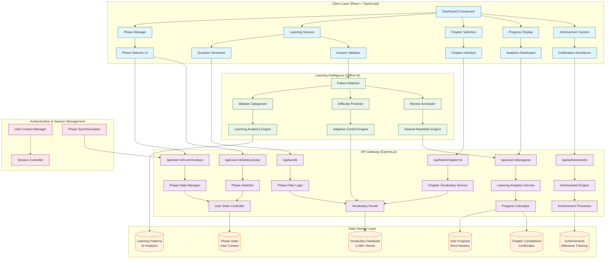
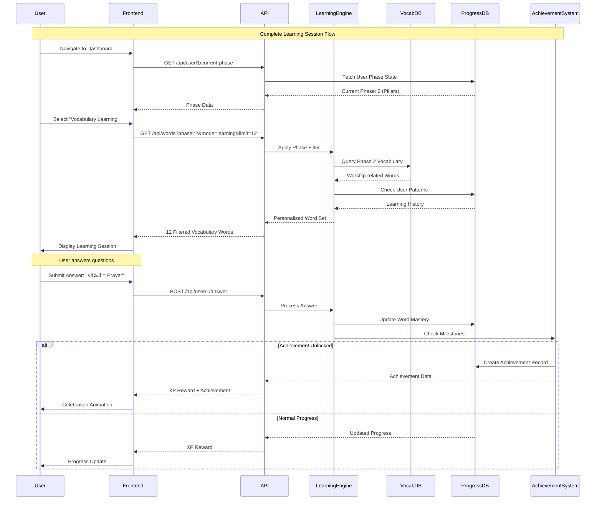
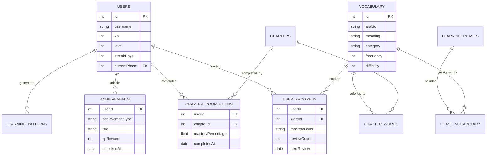

# QuranicFlow Application Infrastructure

## Complete System Architecture

This document provides a comprehensive view of the QuranicFlow application infrastructure, showing how all components connect and interact.

## Main Infrastructure Diagram

## Data Flow Architecture

## Component Integration Map

### Frontend Components → Backend Services

| Frontend Component | API Endpoint | Data Source | Purpose |
|-------------------|--------------|-------------|---------|
| **Dashboard** | `/api/user/1` | User Storage | Profile, XP, Level |
| **Dashboard** | `/api/content-stats` | Vocabulary DB | Word counts, coverage |
| **Phase Manager** | `/api/user/1/current-phase` | Phase State | Current learning phase |
| **Phase Manager** | `/api/user/1/select-phase` | Phase State | Phase switching |
| **Learning Session** | `/api/words?phase=X` | Vocabulary DB + Learning Engine | Phase-filtered vocabulary |
| **Chapter Learning** | `/api/learn/chapter/:id` | Vocabulary DB | Chapter-specific words |
| **Progress Tracking** | `/api/user/1/chapter-progress` | Progress DB | Chapter completion status |
| **Achievement Display** | `/api/user/1/achievements` | Achievement DB | Unlocked achievements |
| **Grammar Mode** | `/api/words?mode=grammar` | Vocabulary DB + Learning Engine | Structural vocabulary |
| **Spaced Review** | `/api/user/1/review` | Progress DB + Learning Engine | Due review words |

### Learning Engine Connections

| Engine Component | Input Source | Output Target | Function |
|-----------------|--------------|---------------|----------|
| **Pattern Matcher** | User Answer Data | Learning Analytics | Identifies learning patterns |
| **Mistake Categorizer** | Answer Validation | Progress Database | Categorizes error types |
| **Difficulty Predictor** | User Performance | Vocabulary Router | Predicts word difficulty |
| **Review Scheduler** | Mastery Levels | Spaced Review API | Calculates optimal review timing |
| **Adaptive Content** | Learning Patterns | Word Selection | Personalizes vocabulary delivery |

### Data Storage Relationships

## API Endpoint Architecture

### Core Learning APIs
- **GET /api/words** - Phase-filtered vocabulary with fallback system
- **GET /api/learn/chapter/:id** - Chapter-specific authentic vocabulary
- **GET /api/user/:id/current-phase** - Current learning phase state
- **POST /api/user/:id/select-phase** - Phase switching with validation

### Progress & Analytics APIs
- **GET /api/user/:id/progress** - Comprehensive learning analytics
- **GET /api/user/:id/chapter-progress** - Chapter completion tracking
- **GET /api/user/:id/review** - Spaced repetition due words
- **POST /api/user/:id/answer** - Answer processing and progress updates

### Achievement & Gamification APIs
- **GET /api/user/:id/achievements** - Unlocked achievements
- **GET /api/user/:id/challenges** - Daily and weekly challenges
- **GET /api/content-stats** - Vocabulary statistics and coverage

## Performance & Reliability Features

### Caching Strategy
- **Frontend**: TanStack Query with 10-second stale time for phase data
- **API**: Response caching with 304 Not Modified for static content
- **Vocabulary**: In-memory caching with efficient filtering algorithms

### Error Handling
- **Frontend**: Comprehensive error boundaries and loading states
- **API**: Graceful degradation with fallback vocabulary selection
- **Storage**: Transaction safety and data integrity validation

### Scalability Design
- **Modular Architecture**: Easy component replacement and extension
- **Database Ready**: PostgreSQL schema prepared for production scaling
- **API Versioning**: RESTful design supporting future API versions
- **Mobile Optimization**: Responsive design with progressive enhancement

This infrastructure supports the complete QuranicFlow learning experience, from vocabulary acquisition through achievement celebration, with robust error handling and scalability for future growth.