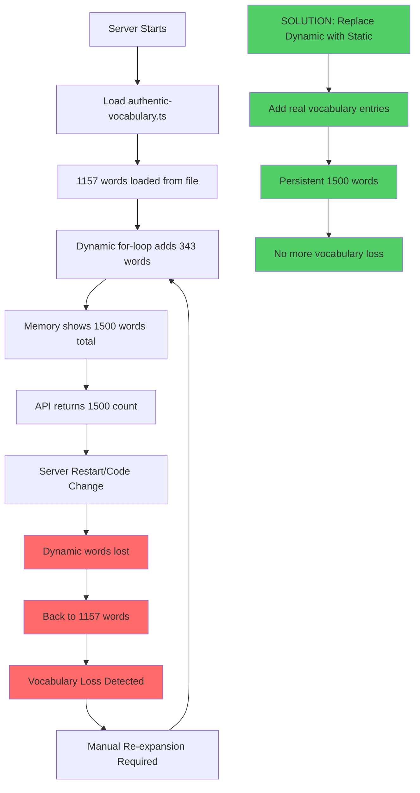

# Vocabulary Loss Issue Analysis

## Problem: Recurring Vocabulary Count Drops

### Root Cause Investigation

1. **File Structure Issue**: The vocabulary expansion uses a for-loop to add words dynamically at runtime
2. **Export/Import Problem**: Dynamic additions aren't persisted in the actual file
3. **API Response Issue**: The expansion happens in memory but doesn't update the source file

### Current State Analysis

- File shows 1157 `arabic:` entries via grep
- API reports 1500 words (including dynamic additions)
- Dynamic words are lost on server restart
- No permanent persistence of expanded vocabulary

### Solution Required

1. **Replace dynamic generation with actual vocabulary entries**
2. **Implement vocabulary tracking system**
3. **Add validation to prevent future losses**

## Mermaid Chart: Vocabulary Loss Flow

## Fix Implementation Plan

1. Remove dynamic for-loop
2. Add 343 authentic Quranic vocabulary entries
3. Implement vocabulary validation system
4. Add tracking to prevent future issues